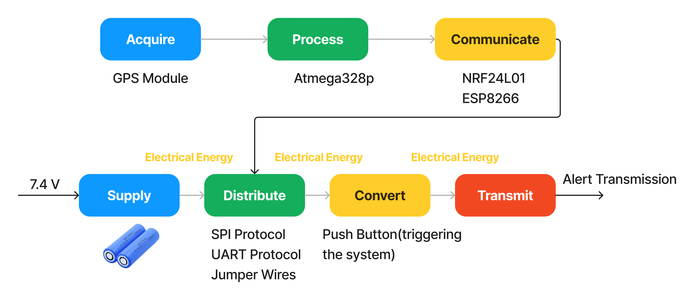
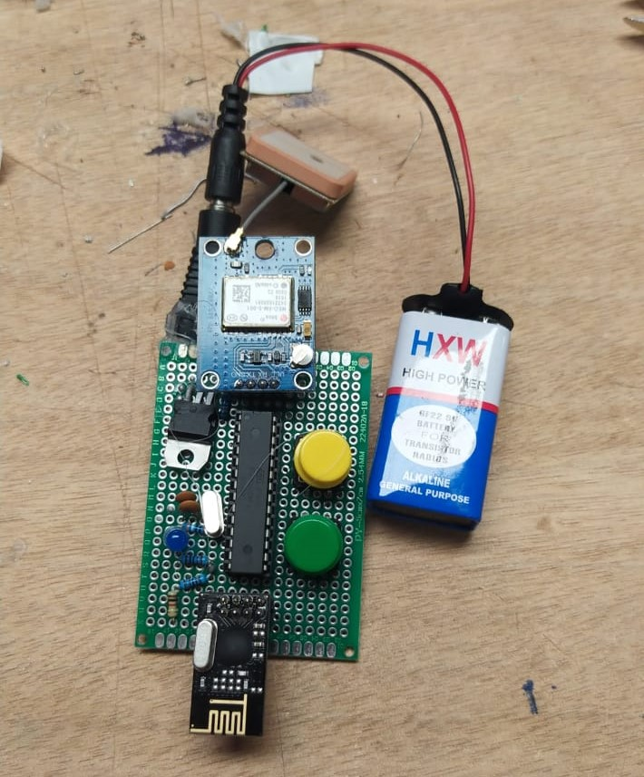

# Connected-Bracelet-PFA-
<h1 align="center">Global Architecture</h1>
* In this Architecture, I used 2 types of communication:
  - P2P(Peer to Peer Communication): This communication is set up between the gadget and the gateway, based on Radio Communication, using NRF24L01 Module.
  - Cloud Communication: This communication is set up between the gateway and the Cloud(Firebase(RTDB Service) in this case)

    

<h1 align="center">Engerny & Information Chain</h1>

    

<h1 align="center">Prototype</h1>
## Components:
* GPS Module(NEO 6M).
* Radio Transceiver Module(NRF24L01).
* Atmega328P(mC).

    

